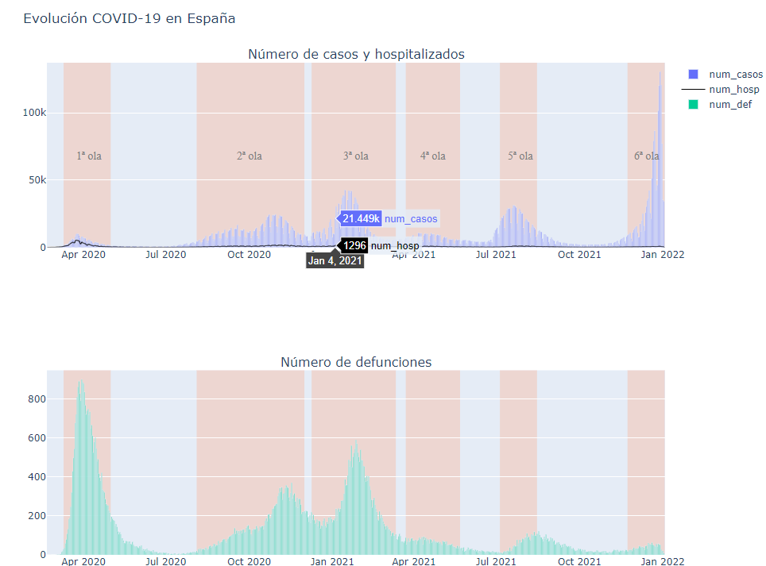
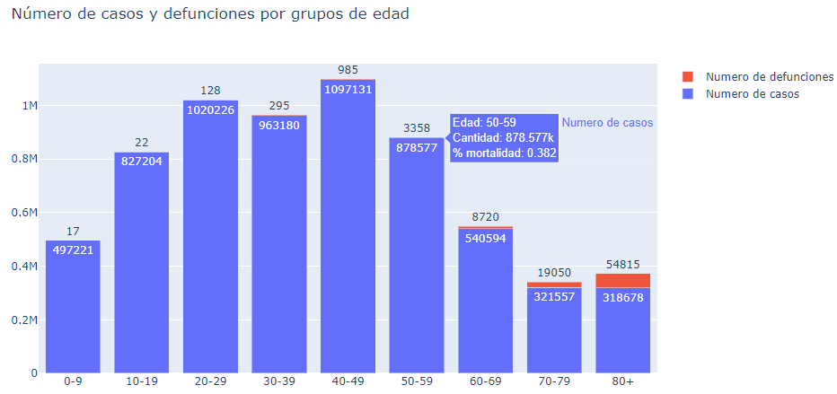
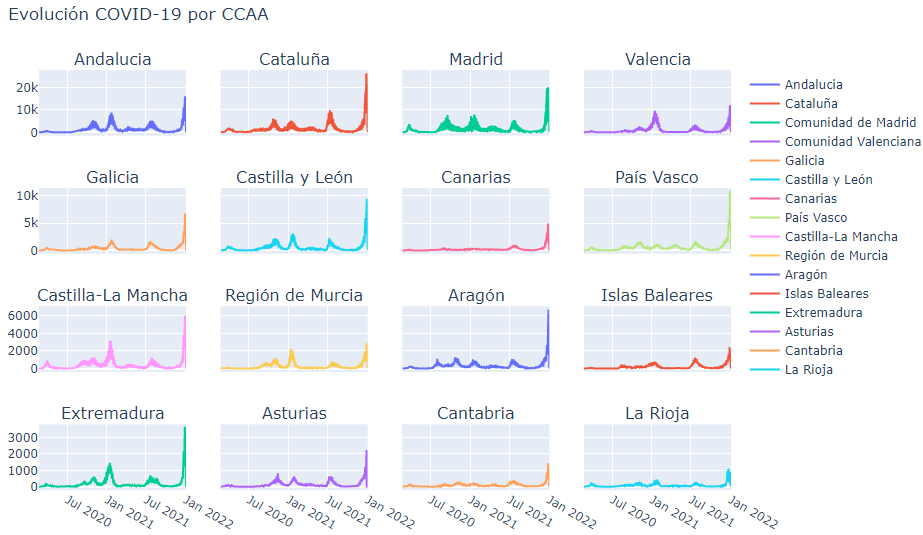
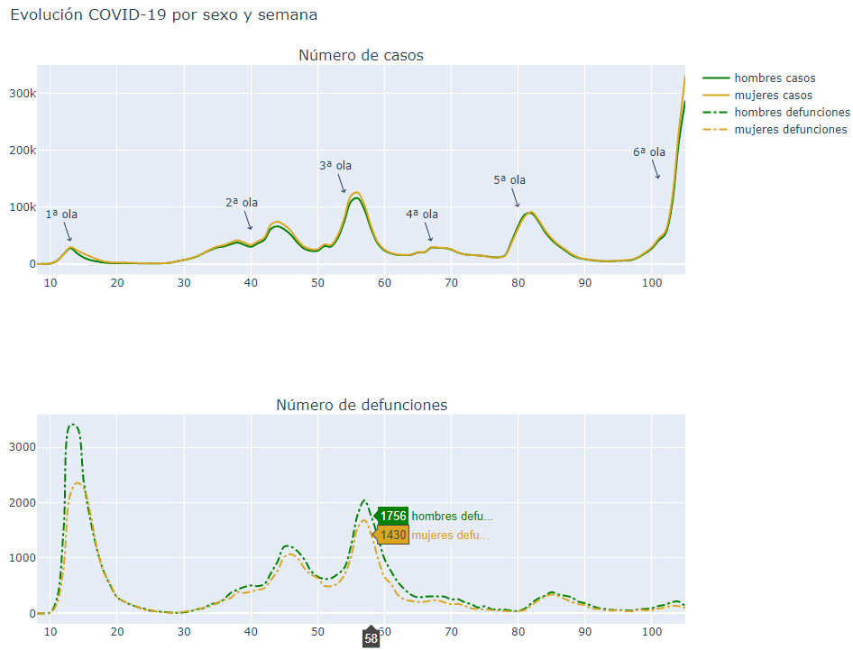
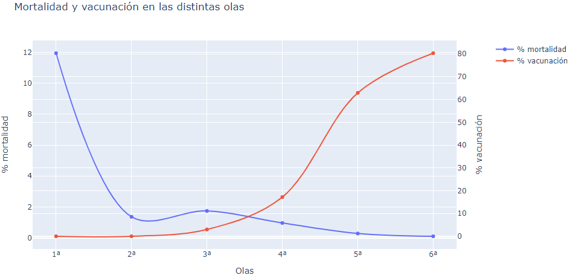

# Panel COVID
Para la visualización de los datos: **[enlace](https://nbviewer.org/github/pachums/python_projects/blob/main/Covid_19/resumen_covid.ipynb)**

## Estructura de archivos:
- `ddatos_covid_tratados`: archivo base para el analisis.
- `datos_periodo.csv`: datos covid separado por periodos
- `poblacion_edad_sexo.csv`: datos sobre la poblacion, edad y sexo de las distintas CCAA.

## Fuentes de datos
- **[Centro Nacional de Epidemiología](https://cnecovid.isciii.es/)**:
        - **Número de casos**
        - **Número de hospitalizaciones**
	- **Número de ingresos en la UCI**
	- **Número de defunciones**
    
## Datos disponibles en la base de datos
- *datos_covid_tratados*:
        - `fecha`: fecha de recogida de datos
	- `codauto`: código de la Comunidad Autónoma
	- `cpro`: código de la Provincia
	- `ccaa`: nombre de la Comunidad Autónoma
	- `provincia`: nombre de la Provincia
	- `sexo`: distinción entre hombres, mujeres y NC.
	- `grupo_edad`: nueve grupos de edad, 0-9, 10-19, ... , 70-79, +80.
        - `num_casos`: Número de casos positivos.
        - `num_hosp`: Número de casos hospitalizados.
        - `num_uci`: Número de casos ingresados en la UCI.
        - `num_def`: Número de defunciones.

- *poblacion_edad_sexo*:
	- `sexo`: distinción entre hombres, mujeres y NC.
	- `cpro`: código de la Provincia
	- `grupo_edad`: nueve grupos de edad, 0-9, 10-19, ... , 70-79, +80.
        - `poblacion_total`: población total en función del sexo, cpro y grupo edad.
        - `poblacion_agregada`: población total en función de sexo y cpro.
        - `porcentaje`: porcentaje de población total con respecto a la población agregada.

- *poblacion_edad_sexo*:
	- `cpro`: código de la Provincia
	- `sexo`: distinción entre hombres, mujeres y NC.
	- `grupo_edad`: nueve grupos de edad, 0-9, 10-19, ... , 70-79, +80.
	- `codauto`: código de la Comunidad Autónoma
	- `provincia`: nombre de la Provincia
        - `num_casos`: Número de casos positivos.
        - `num_def`: Número de defunciones.
        - `poblacion_total`: población total en función del sexo, cpro y grupo edad.
        - `poblacion_agregada`: población total en función de sexo y cpro.
        - `porcentaje`: porcentaje de población total con respecto a la población agregada.
	- `ccaa`: nombre de la Comunidad Autónoma

## Visualizaciones

## Contacto 
- Francisco Martínez Serrano <pachums97@gmail.com>